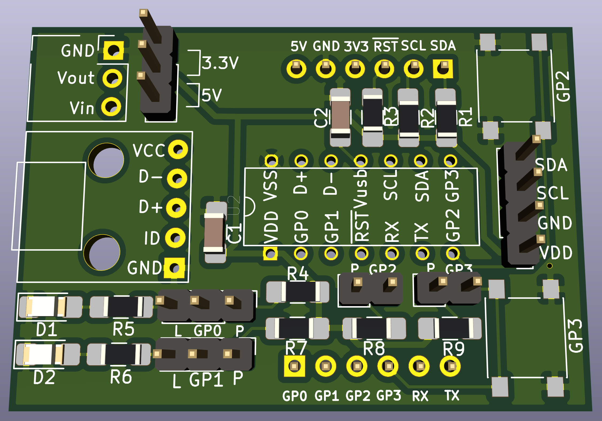
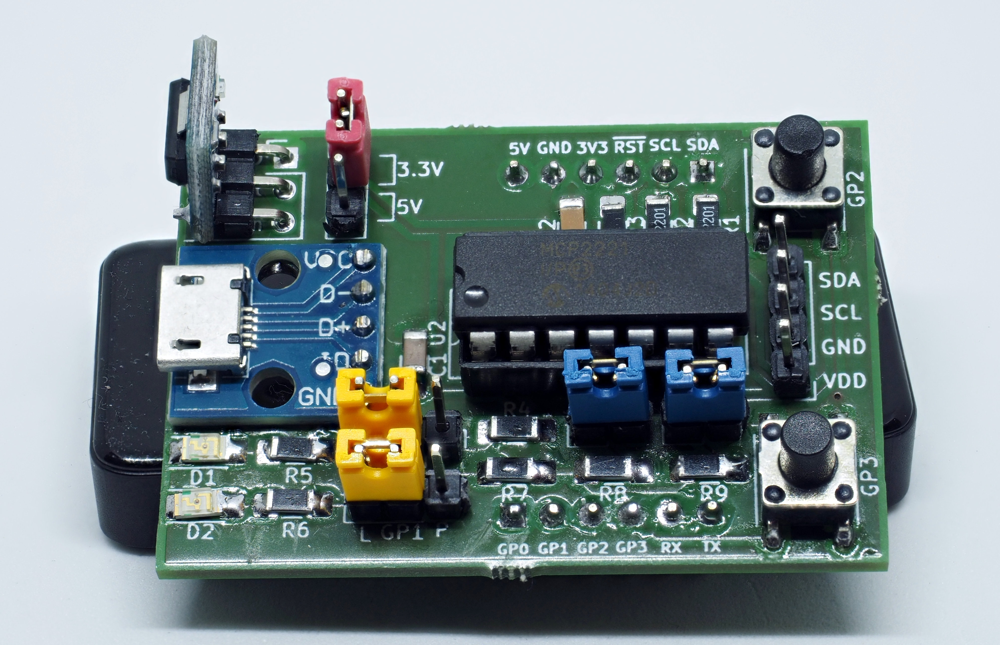

A small pcb for the MCP2221 chip
================================

The MCP2221 chip is an USB to GPIO bridge and brings GPIOs (including I2C) to any computer.

This github-repository contains a Kicad-project for the chip:

Status
------

Current status: the pcb was successfully produced
by [https://aisler.net](https://aisler.net):

Hardware
--------

Components for the board:

  - MCP2221/MCP2221A
  - socket
  - two capacitors (required, see datasheet)
  - a micro-sd-female connector (breakout)
  - an AMS1117 5V->3.3V converter (breakout, configurable using jumper-shim)
  - pullups for I2C-pins
  - pullups for GP0-GP3 (configurable using jumper-shims)
  - LEDs for GP0 and GP1 (configurable using jumper-shims)
  - buttons for GP2 and GP3
  - two male-connectors exposing all pins of the MCP2221 (breadboard-friendly spacing)

You can find details in the file `part-list.ods`.
